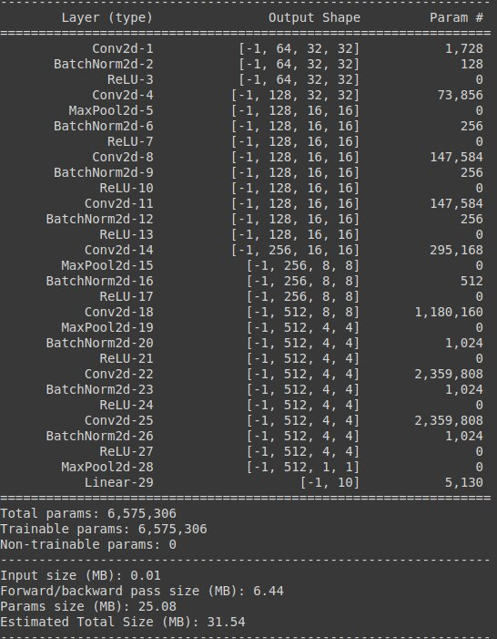
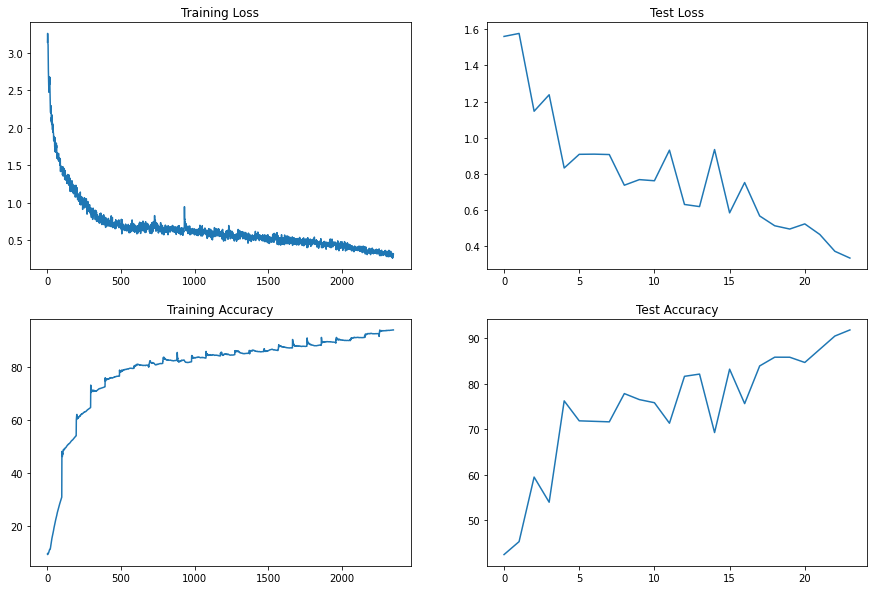

# TARGET
* Custom ResNet architecture for CIFAR10 with following architecture
1. Prep Layer - 3x3 Conv (stride=padding=1) > BatchNorm > ReLU (64 channels)
2. Layer 1
      1. X = 3x3 Conv (stride=padding=1) > MaxPool (2x2, stride=2) > BatchNorm > ReLU (128 channels)
      2. R1 = ResBlock((3x3 Conv-BN-ReLU-3x3 Conv-BN-ReLU))(X) (128 channels)
      3. Add(X, R1)
3. Layer2 - 3x3 Conv (stride=padding=1) > MaxPool (2x2, stride=2) > BatchNorm > ReLU (256 channels)
4. Layer3
      1. X = 3x3 Conv (stride=padding=1) > MaxPool (2x2, stride=2) > BatchNorm > ReLU (512 channels)
      2. R2 = ResBlock((3x3 Conv-BN-ReLU-3x3 Conv-BN-ReLU))(X) (512 channels)
      3. Add(X, R1)
5. MaxPool (4x4, stride=4)
6. Fully connected layer (512 > 10)
7. Log Softmax activation

* One Cycle Learning Rate Scheduler
1. Total Epochs-24
2. Max LR at 5th epoch
3. LR min = 0
4. LR max - Find using LR test
5. No Annihilation/Tempering

* Augmentation sequence - RandomCrop 32x32 (after padding of 4) >> FlipLR >> Followed by CutOut(8, 8). Implemented using Albumentations lib.
* Batch size - 512
* Target Accuracy - 93%

# RESULTS
1. Model summary

2. LR Test - Model trained for 10 epochs for LRs: 1e-5, 1e-4, 1e-3, 1e-3 giving min validation losses of 0.5270288520812988, 0.5230412246704101, 0.504125309753418, 0.5248147918701171 respectively.
3. One Cycle LR 
      1. min_lr = 0
      2. max_lr = 1e-2
      3. step_size_up = 98 (iterations per epoch) * 5
      4. step_size_down = 98 * 19
4. L2 regularization coefficient - 1e-1 
5. 90.44%, 91.78% validation accuracy in 23rd, 24th epoch respectively. (1e-3, 1e-2 LRs without L2 regularization give max validation accuracies of 75.83%, 88.68% resp)
6. Loss Curves

