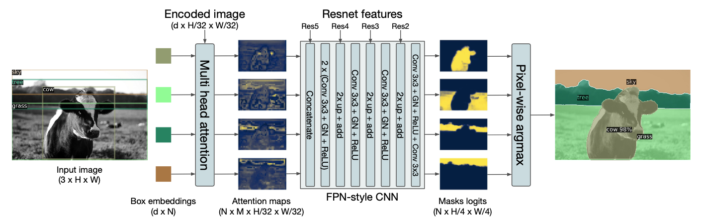

## We take the encoded image (dxH/32xW/32) and send it to Multi-Head Attention (FROM WHERE DO WE TAKE THIS ENCODED IMAGE?)
The Encoded Image is the output from penultimate CNN layer of ResNet50 trained on BBox prediction, giving it a dimension of dxH/32xW/32 (d channels, high and width 1/32 of the input dimensions).

## We do something here to generate NxMxH/32xW/32 maps. (WHAT DO WE DO HERE?)
These attention maps are generated by the multi-head self attention Transformer encoder-decoder block. 

## Then we concatenate these maps with Res5 Block (WHERE IS THIS COMING FROM?)
Output of 5th block of ResNet50, which provides for BBox embedding to Transformer block, is taken as a skip connection and concatenated with attention maps. 

## Then we perform the above steps (EXPLAIN THESE STEPS)
1.  The attention maps obtained from multi-head transformer block is concatenated with ResNet block output from 5th block and convolved, Group Norm, ReLU, followed by upscaling (using bilinear interpolation) and adding to output of 4th block of Resnet50 (which was used for BBox prediction). This is again convolved, GN, ReLU, upscaled and added to output of 3rd block from ResNet50. This process is repeated again and output is added to output of 2nd block of Resnet50, followed by last round of convolution, GN, ReLU. 
2.  The resulting output has dimensions of NxH/4xW/4 (N channels, 4 times lesser in size than input image). For each pixel, argmax of values across all channels is taken to identify the segment it belongs to, yielding the panoptic segmentation output. 
